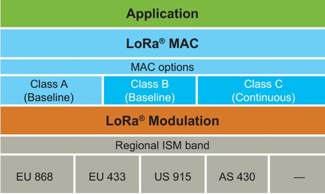
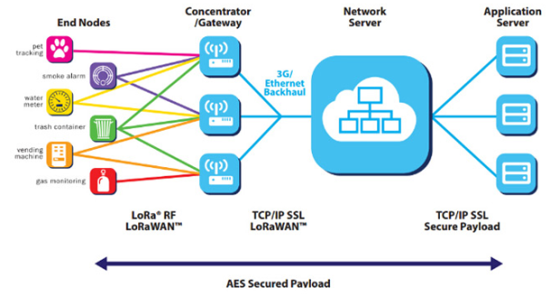
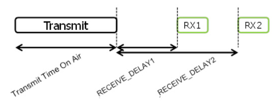
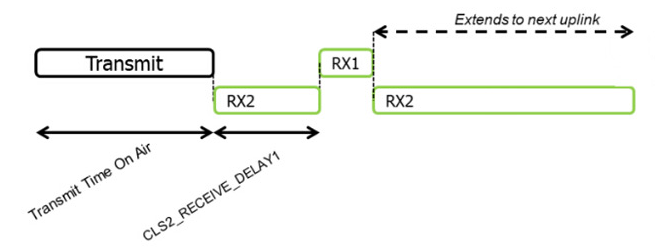
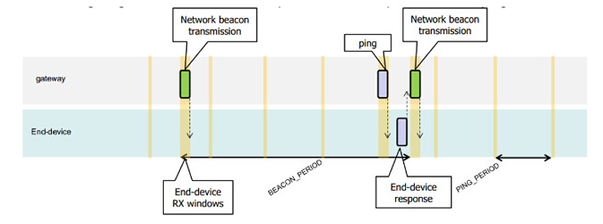
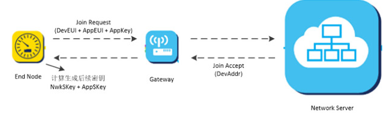
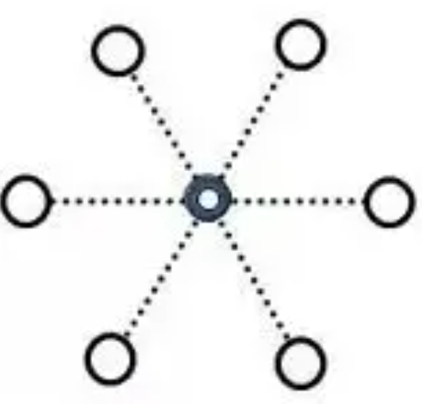
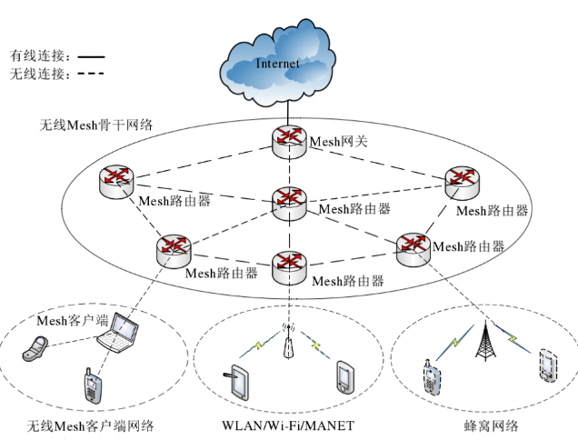

# 简介
## 1.什么是LoRa
LoRa（Long Range，远距离）是一种调制技术，是低功耗广域网通信技术中的一种，它是Semtech公司专有的一种基于扩频技术的超远距离无线传输技术。 LoRa调制是物理层（PHY），可为不同协议和不同网络架构所用。
LoRa主要在ISM频段运行（即非授权频段），包括 433、868、915 MHz 等。LoRa 网络构架由终端节点、网关、网络服务器和应用服务器四部分组成，应用数据可双向传输。
除此之外，LoRa还具有远距离、易布置、寿命长、成本低等特点。

LoRa网关、LoRa集中器和LoRa节点的区别：

- LoRa网关：将多个节点或集中器的LoRa数据转换为其他信号数据并进行收发的设备
- LoRa集中器：将多个节点的数据收集，集中发给网关和下发网关数据的设备
- LoRa节点：进行感应或控制的终端设备

LoRaWAN在协议和网络架构的设计上，充分考虑了节点功耗，网络容量，QoS，安全性和网络应用多样性等几个因素。
## 2.LoRaWAN 网络架构
如下是LoRa联盟官方白皮书中的网络架构图。

可以看到一个LoRaWAN网络架构中包含了终端、基站、NS(网络服务器)、应用服务器这四个部分。基站和终端之间采用星型网络拓扑，由于LoRa的长距离特性，它们之间得以使用单跳传输。在终端部分官方列了6个典型应用，有个细节，你会发现终端节点可以同时发给多个基站。基站则对NS和终端之间的LoRaWAN协议数据做转发处理，将LoRaWAN数据分别承载在了LoRa射频传输和TCP/IP上。
## 3.协议概述
### 终端节点的分类
在开头的介绍中我们就看到有协议中有规定 Class A/B/C 三类终端设备，这三类设备基本覆盖了物联网所有的应用场景。

| Class | 介绍 | 下行时机 | 应用场景 |
| --- | --- | --- | --- |
| A(all) | Class A 的中断采用ALOHA协议按需上报数据。在每次上行后都会紧跟两个短暂的下行接收窗口，以此实现双向传输。这种操作是最省电的。 | 必须等待中断上报数据后才能对其下发数据。 | 垃圾桶监测、烟雾报警器、气体检测等 |
| B(beacon) | Class B 的终端，除了Class A的随机接收窗口，还会再指定时间打开接收窗口。为了让终端可以再指定时间打开接收窗口，终端需要从网关接收时间同步信标。 | 再终端固定接收窗口即可对其下发数据，下发的延时有所提高 | 阀控水气电表等 |
| C(continuous) | Class C 的终端基本是一直打开着接收窗口，只在发送时短暂关闭。Class C 的终端会比Class A 和Class B 更加耗电 | 由于终端处于持续接收状态，可在任意时间对终端下发数据。 | 路灯控制等 |

### 终端节点的上下行传输
这是Class A 上下行的时序图，目前接收窗口RX1一般是在上行后1秒开始，接收窗口RX2是在上行后2秒开始。

Class C 和 A 基本是相同的，只是在 Class A 休眠的期间，它都打开了接收窗口RX2。

Class B 的时隙则复杂一些，它有一个同步时隙beacon，还有一个固定周期的接收窗口ping时隙。如这个示例中，beacon周期为128秒，ping周期为32秒。

### 终端节点的加网
搞明白了基础概念之后，就可以了解节点如何工作了。在正式收发数据之前，终端都必须先加网。
有两种加网方式：Over-the-Air Activation(空中激活方式 OTAA)，Activation by Personalization(独立激活方式 ABP)。
商用的LoRaWAN网络一般都是走OTAA激活流程，这样安全性才得以保证。此种方式需要准备 DevEUI，AppEUI，AppKey 这三个参数。

DevEUI 是一个类似IEEE EUI64的全球唯一ID，标识唯一的终端设备。相当于是设备的MAC地址。
AppEUI 是一个类似IEEE EUI64的全球唯一ID，标识唯一的应用提供者。比如各家的垃圾桶监测应用、烟雾报警器应用等等，都具有自己的唯一ID。
AppKey 是由应用程序拥有者分配给终端。
终端在发起加网join流程后，发出加网命令，NS(网络服务器)确认无误后会给终端做加网回复，分配网络地址 DevAddr(32位ID)，双方利用加网回复中的相关信息以及AppKey，产生会话密钥NwkSKey和AppSKey，用来对数据进行加密和校验。
如果是采用第二种加网方式，即ABP激活，则比较简单粗暴，直接配置 DevAddr，NwkSKey，AppSKey 这三个LoRaWAN最终通讯的参数，不再需要join流程。在这种情况下，这个设备是可以直接发应用数据的。
### 数据收发
加网之后，应用数据就被加密处理了。
LoRaWAN规定数据帧类型有 Confirmed 或者 Unconfirmed 两种，即 需要应答 和不需要应答类型。厂商可以根据应用需要选择合适的类型。
另外，从介绍中可以看到，LoRaWAN设计之初的一大考虑就是要支持应用多样性。除了利用 AppEUI 来划分应用外，在传输时也可以利用 FPort 应用端口来对数据分别处理。FPort 的取值范围是(1~223)，由应用层来指定。
### ADR 机制
我们知道LoRa调制中有扩频因子的概念，不同的扩频因子会有不同的传输距离和传输速率，且对数据传输互不影响。
为了扩大LoRaWAN网络容量，在协议上了设计一个LoRa速率自适应(Adaptive data rate - ADR)机制，不同传输距离的设备会根据传输状况，尽可能使用最快的数据速率。这样也使得整体的数据传输更有效率。
### MAC命令
针对网络管理需要，在协议上设计了一系列的MAC命令，来修改网络相关参数。比如接收窗口的延时，设备速率等等。在实际应用过程中，一般很少涉及，暂时不管。

# LoRa组网方式
在无线通讯种，最常见的组网方式有两种，一种是**星型组网**，一种是**Mesh组网**。
大家最常用的是星型组网，这种组网方式比较方便，开发简单而且稳定性比较好。
Mesh组网一般适用于一些比较复杂的系统中， Mesh组网就是探测器有中继功能，可以“无限”的延长无线通讯的距离。
Mesh组网，理论简单，但开发和实施比较复杂。
## LoRa如何组网
### 星状组网
最常见的局域网的组网方式是星状组网。

星状组网是由**中心节点**和**终端节点**组成。如上图，中间的黑色圈就是中心节点，外部的小圆圈属于终端节点。

- 中心节点：就相当的一个网关，也是数据的处理中心。
- 终点节点：就相当于探测器配件，遥控器，无线门磁，烟感，燃气探测器等

**星状组网：**
**第一步: **中心节点和 终端节点都要支持Lora通讯，而且通讯的参数必须一致，包括**频率**，**数据速率**、**射频因子**等。
**第二步:** 操作中心节点（网关），让其进入配对模式。 在触发终端节点（无线遥控器，门磁…）发送Lora无线数据，网关收到无线通讯的数据，解析获取终端节点的设备地址，并存储在中心节点的内存中。
**第三步：**第二步操作成功，表示终端节点的设备地址已被中心节点保存，再次触发终端节点发送Lora无线数据，网关就可以识别，并解析终端数据。
**配对需要注意：**

1. 学习配对期间，防止其他探测器的干扰，不能多个终端设备同时发送Lora信号
2. 终端节点在每次的数据交互过程中，无线数据必须要包括设备的节点地址。大家可以根据实际情况来定义，默认1个字节，一个中心设备最多支持255个终端设备. 如果不能满足，可以选择2个字节，最大支持65535个终端。

**星状组网的缺点:**

1. 一个终端节连续发送数据，会直接影响其他终端节点与中心节点的通信，可能导致其他终端节点无法正常与中心节点进行通信。
2. 因中心节点，同1时间点，只能接收一个终端节点的数据，如果多个终端节点同时传输数据的时候，会导致数据丢失
### Mesh组网
除了星状组网，还有还有一种比较热门的组网方式：Mesh组网。其中蓝牙MESH，Zigbee MesH 应用最常见。

Mesh无线网络中，设备分为三类：**Mesh网关**，**Mesh路由器**，**Mesh终端节点**。

- Mesh网关: 就和星状组网的中心节点一样，无线数据的接收处理中心。
- Mesh路由器: 属于终端节点的，其特点是外电供电，具有无线数据中继功能。例如无线智能插座。
- Mesh终端节点：数据终端节点，特点是电池供电，需要进入休眠状态，无中继功能。例如无线门磁。

**Mesh组网的优点： **可以极大的延长无线数据的传输距离
**Mesh组网的缺点: **算法负责，开发难度大，和对终端节点的安装布局要求高，容易出现无线数据干扰，碰撞。
关于星状组网 和Mesh组网，在大多数情况下，我建议大家使用星状组网，开发简单，稳定性高。 在传输距离远，探测器分布比较分散的情况下，建议大家使用Mesh组网。
