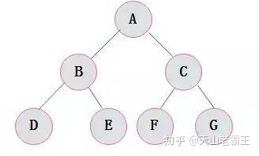
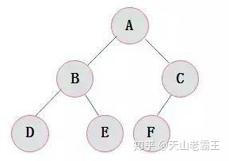
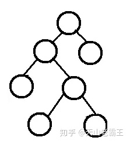
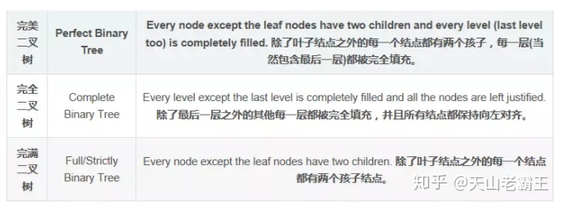
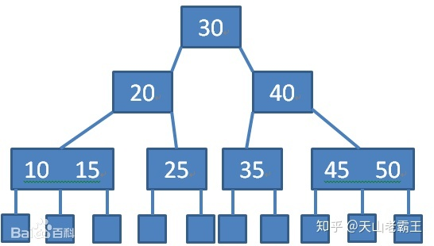
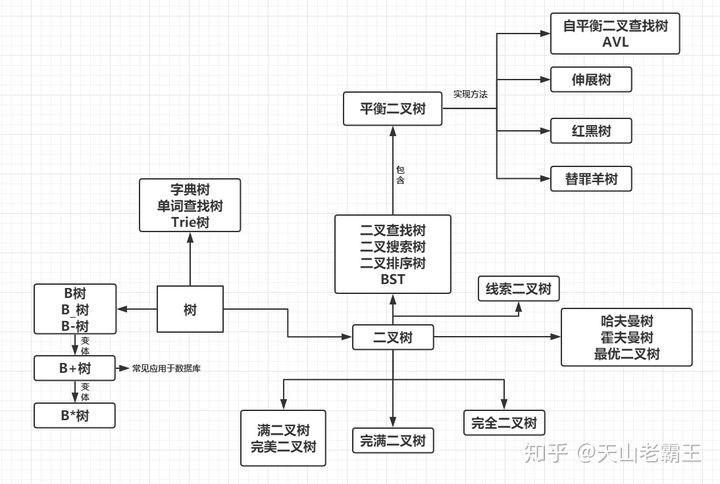

# 数据结构

## 1.树

**树状图**是一种数据结构，它是由n（n>=1）个有限结点组成一个具有层次关系的集合。把它叫做“树”是因为它看起来像一棵倒挂的树，也就是说它是根朝上，而叶朝下的。

**它具有以下的特点：**每个结点有零个或多个子结点；没有父结点的结点称为根结点；每一个非根结点有且只有一个父结点；除了根结点外，每个子结点可以分为多个不相交的子树；

**树结构是一种非线性存储结构，存储的是具有“一对多”关系的数据元素的集合。**

### **术语：**

>   节点深度：对任意节点x，x节点的深度表示为根节点到x节点的路径长度。所以根节点深度为0，第二层节点深度为1，以此类推
>   节点高度：对任意节点x，叶子节点到x节点的路径长度就是节点x的高度
>   树的深度：一棵树中节点的最大深度就是树的深度，也称为高度
>   父节点：若一个节点含有子节点，则这个节点称为其子节点的父节点
>   子节点：一个节点含有的子树的根节点称为该节点的子节点
>   节点的层次：从根节点开始，根节点为第一层，根的子节点为第二层，以此类推
>   兄弟节点：拥有共同父节点的节点互称为兄弟节点
>   度：节点的子树数目就是节点的度
>   叶子节点：度为零的节点就是叶子节点
>   祖先：对任意节点x，从根节点到节点x的所有节点都是x的祖先（节点x也是自己的祖先）
>   后代：对任意节点x，从节点x到叶子节点的所有节点都是x的后代（节点x也是自己的后代）
>   森林：m颗互不相交的树构成的集合就是森林

### **树的种类**

**无序树**

>   树的任意节点的子节点没有顺序关系。

**有序树**

>   树的任意节点的子节点有顺序关系。

**二叉树**

>   树的任意节点至多包含两棵子树。
>   **二叉树遍历:**
>   二叉树的遍历是指从二叉树的根结点出发，按照某种次序依次访问二叉树中的所有结点，使得每个结点被访问一次，且仅被访问一次。
>   **二叉树的访问次序可以分为四种：**
>   前序遍历 中序遍历 后序遍历 层次遍历

**满二叉树**

>   叶子节点都在同一层并且除叶子节点外的所有节点都有两个子节点。

**完全二叉树**

>   对于一颗二叉树，假设其深度为d（d>1）。除第d层外的所有节点构成满二叉树，且第d层所有节点从左向右连续地紧密排列，这样的二叉树被称为完全二叉树；

**完满二叉树**

**霍夫曼树**

>   带权路径最短的二叉树称为哈夫曼树或最优二叉树。

**二叉查找树（二叉搜索树、二叉排序树、BST）[这几个都是别名]**

>   若任意节点的左子树不空，则左子树上所有节点的值均小于它的根节点的值；
>   若任意节点的右子树不空，则右子树上所有节点的值均大于它的根节点的值；
>   任意节点的左、右子树也分别为二叉查找树；
>   没有键值相等的节点

**平衡二叉树**

>   它是一棵空树或它的左右两个子树的高度差的绝对值不超过1，并且左右两个子树都是一棵平衡二叉树，同时，平衡二叉树必定是二叉搜索树。

**AVL树**

>   在计算机科学中，**AVL树**是最先发明的自平衡二叉查找树。在AVL树中任何节点的两个子树的高度最大差别为1，所以它也被称为**高度平衡树**。增加和删除可能需要通过一次或多次[树旋转](https://link.zhihu.com/?target=https%3A//baike.baidu.com/item/%E6%A0%91%E6%97%8B%E8%BD%AC)来重新平衡这个树。
>   AVL树本质上还是一棵二叉搜索树，它的特点是：
>   1.本身首先是一棵二叉搜索树。
>   2.带有平衡条件：每个结点的左右子树的高度之差的绝对值（平衡因子）最多为1。
>   也就是说，AVL树，本质上是带了平衡功能的二叉查找树（二叉排序树，二叉搜索树）。
>   **使用场景：**
>   **AVL树适合用于插入删除次数比较少，但查找多的情况。**
>   **也在`Windows`进程地址空间管理中得到了使用**
>   **旋转的目的是为了降低树的高度，使其平衡**

**红黑树**

>   红黑树是每个节点都带有颜色属性的二叉查找树，颜色或红色或黑色。在二叉查找树强制一般要求以外，对于任何有效的红黑树我们增加了如下的额外要求:
>   性质1. 节点是红色或黑色。
>   性质2. 根节点是黑色。
>   性质3. 每个红色节点的两个子节点都是黑色。(从每个叶子到根的所有路径上不能有两个连续的红色节点)
>   性质4. 从任一节点到其每个叶子的所有路径都包含相同数目的黑色节点。
>   **使用场景：**
>   **红黑树多用于搜索,插入,删除操作多的情况下**
>   **红黑树应用比较广泛：**
>   **1. 广泛用在`C++`的`STL`中。`map`和`set`都是用红黑树实现的。**
>   **2. 著名的`linux`进程调度`Completely Fair Scheduler`,用红黑树管理进程控制块。**
>   **3.`epoll`在内核中的实现，用红黑树管理事件块**
>   **4.`nginx`中，用红黑树管理`timer`等**

**伸展树**

>   伸展树（Splay Tree），也叫分裂树，是一种[二叉排序树](https://link.zhihu.com/?target=https%3A//baike.baidu.com/item/%E4%BA%8C%E5%8F%89%E6%8E%92%E5%BA%8F%E6%A0%91/10905079)，它能在O(log n)内完成插入、查找和删除操作。它由**丹尼尔·斯立特**Daniel Sleator 和 **罗伯特·恩卓·塔扬**Robert Endre Tarjan 在1985年发明的。
>   在伸展树上的一般操作都基于伸展操作：假设想要对一个二叉查找树执行一系列的查找操作，为了使整个查找时间更小，被查频率高的那些条目就应当经常处于靠近树根的位置。于是想到设计一个简单方法， 在每次查找之后对树进行重构，把被查找的条目搬移到离树根近一些的地方。伸展树应运而生。伸展树是一种自调整形式的二叉查找树，它会沿着从某个节点到树根之间的路径，通过一系列的旋转把这个节点搬移到树根去。
>   它的优势在于不需要记录用于平衡树的冗余信息。

**替罪羊树**

>   替罪羊树是[计算机科学](https://link.zhihu.com/?target=https%3A//baike.baidu.com/item/%E8%AE%A1%E7%AE%97%E6%9C%BA%E7%A7%91%E5%AD%A6/9132)中，一种基于部分重建的自平衡二叉搜索树。在替罪羊树上，插入或删除节点的平摊最坏[时间复杂度](https://link.zhihu.com/?target=https%3A//baike.baidu.com/item/%E6%97%B6%E9%97%B4%E5%A4%8D%E6%9D%82%E5%BA%A6)是[O](https://link.zhihu.com/?target=https%3A//baike.baidu.com/item/O)(log n)，搜索节点的最坏时间复杂度是O(log n)。
>   在非平衡的[二叉搜索树](https://link.zhihu.com/?target=https%3A//baike.baidu.com/item/%E4%BA%8C%E5%8F%89%E6%90%9C%E7%B4%A2%E6%A0%91)中，每次操作以后检查操作路径，找到最高的满足max(size(son_L),size(son_R))>alpha*size(this)的结点，重建整个子树。这样就得到了替罪羊树，而被重建的子树的原来的根就被称为替罪羊节点。替罪羊树替罪羊树是一棵自平衡二叉搜索树，由ArneAndersson提出。替罪羊树的主要思想就是将不平衡的树压成一个序列,然后暴力重构成一颗平衡的树。

**B-tree（B-树或者B树）**

>   一棵m阶B树(balanced tree of order m)是一棵平衡的m路搜索树。它或者是空树，或者是满足下列性质的树：
>   1、根结点至少有两个子女；
>   2、每个非根节点所包含的关键字个数 j 满足：┌m/2┐ - 1 <= j <= m - 1；
>   3、除根结点以外的所有结点（不包括叶子结点）的度数正好是关键字总数加1，故**内部子树**个数 k 满足：┌m/2┐ <= k <= m ；
>   4、所有的叶子结点都位于同一层。

**伸展树**

>   伸展树（Splay Tree），也叫分裂树，是一种[二叉排序树](https://link.zhihu.com/?target=https%3A//baike.baidu.com/item/%E4%BA%8C%E5%8F%89%E6%8E%92%E5%BA%8F%E6%A0%91/10905079)，它能在O(log n)内完成插入、查找和删除操作。它由**丹尼尔·斯立特**Daniel Sleator 和 **罗伯特·恩卓·塔扬**Robert Endre Tarjan 在1985年发明的。
>   在伸展树上的一般操作都基于伸展操作：假设想要对一个二叉查找树执行一系列的查找操作，为了使整个查找时间更小，被查频率高的那些条目就应当经常处于靠近树根的位置。于是想到设计一个简单方法， 在每次查找之后对树进行重构，把被查找的条目搬移到离树根近一些的地方。伸展树应运而生。伸展树是一种自调整形式的二叉查找树，它会沿着从某个节点到树根之间的路径，通过一系列的旋转把这个节点搬移到树根去。
>   它的优势在于不需要记录用于平衡树的冗余信息。

**替罪羊树**

>   替罪羊树是[计算机科学](https://link.zhihu.com/?target=https%3A//baike.baidu.com/item/%E8%AE%A1%E7%AE%97%E6%9C%BA%E7%A7%91%E5%AD%A6/9132)中，一种基于部分重建的自平衡二叉搜索树。在替罪羊树上，插入或删除节点的平摊最坏[时间复杂度](https://link.zhihu.com/?target=https%3A//baike.baidu.com/item/%E6%97%B6%E9%97%B4%E5%A4%8D%E6%9D%82%E5%BA%A6)是[O](https://link.zhihu.com/?target=https%3A//baike.baidu.com/item/O)(log n)，搜索节点的最坏时间复杂度是O(log n)。
>   在非平衡的[二叉搜索树](https://link.zhihu.com/?target=https%3A//baike.baidu.com/item/%E4%BA%8C%E5%8F%89%E6%90%9C%E7%B4%A2%E6%A0%91)中，每次操作以后检查操作路径，找到最高的满足max(size(son_L),size(son_R))>alpha*size(this)的结点，重建整个子树。这样就得到了替罪羊树，而被重建的子树的原来的根就被称为替罪羊节点。替罪羊树替罪羊树是一棵自平衡二叉搜索树，由ArneAndersson提出。替罪羊树的主要思想就是将不平衡的树压成一个序列,然后暴力重构成一颗平衡的树。

**B-tree（B-树或者B树）**

>   一棵m阶B树(balanced tree of order m)是一棵平衡的m路搜索树。它或者是空树，或者是满足下列性质的树：
>   1、根结点至少有两个子女；
>   2、每个非根节点所包含的关键字个数 j 满足：┌m/2┐ - 1 <= j <= m - 1；
>   3、除根结点以外的所有结点（不包括叶子结点）的度数正好是关键字总数加1，故**内部子树**个数 k 满足：┌m/2┐ <= k <= m ；
>   4、所有的叶子结点都位于同一层。

**伸展树**

>   伸展树（Splay Tree），也叫分裂树，是一种[二叉排序树](https://link.zhihu.com/?target=https%3A//baike.baidu.com/item/%E4%BA%8C%E5%8F%89%E6%8E%92%E5%BA%8F%E6%A0%91/10905079)，它能在O(log n)内完成插入、查找和删除操作。它由**丹尼尔·斯立特**Daniel Sleator 和 **罗伯特·恩卓·塔扬**Robert Endre Tarjan 在1985年发明的。
>   在伸展树上的一般操作都基于伸展操作：假设想要对一个二叉查找树执行一系列的查找操作，为了使整个查找时间更小，被查频率高的那些条目就应当经常处于靠近树根的位置。于是想到设计一个简单方法， 在每次查找之后对树进行重构，把被查找的条目搬移到离树根近一些的地方。伸展树应运而生。伸展树是一种自调整形式的二叉查找树，它会沿着从某个节点到树根之间的路径，通过一系列的旋转把这个节点搬移到树根去。
>   它的优势在于不需要记录用于平衡树的冗余信息。

**替罪羊树**

>   替罪羊树是[计算机科学](https://link.zhihu.com/?target=https%3A//baike.baidu.com/item/%E8%AE%A1%E7%AE%97%E6%9C%BA%E7%A7%91%E5%AD%A6/9132)中，一种基于部分重建的自平衡二叉搜索树。在替罪羊树上，插入或删除节点的平摊最坏[时间复杂度](https://link.zhihu.com/?target=https%3A//baike.baidu.com/item/%E6%97%B6%E9%97%B4%E5%A4%8D%E6%9D%82%E5%BA%A6)是[O](https://link.zhihu.com/?target=https%3A//baike.baidu.com/item/O)(log n)，搜索节点的最坏时间复杂度是O(log n)。
>   在非平衡的[二叉搜索树](https://link.zhihu.com/?target=https%3A//baike.baidu.com/item/%E4%BA%8C%E5%8F%89%E6%90%9C%E7%B4%A2%E6%A0%91)中，每次操作以后检查操作路径，找到最高的满足max(size(son_L),size(son_R))>alpha*size(this)的结点，重建整个子树。这样就得到了替罪羊树，而被重建的子树的原来的根就被称为替罪羊节点。替罪羊树替罪羊树是一棵自平衡二叉搜索树，由ArneAndersson提出。替罪羊树的主要思想就是将不平衡的树压成一个序列,然后暴力重构成一颗平衡的树。

**B-tree（B-树或者B树）**

>   一棵m阶B树(balanced tree of order m)是一棵平衡的m路搜索树。它或者是空树，或者是满足下列性质的树：
>   1、根结点至少有两个子女；
>   2、每个非根节点所包含的关键字个数 j 满足：┌m/2┐ - 1 <= j <= m - 1；
>   3、除根结点以外的所有结点（不包括叶子结点）的度数正好是关键字总数加1，故**内部子树**个数 k 满足：┌m/2┐ <= k <= m ；
>   4、所有的叶子结点都位于同一层。

>   B树(B-Tree)是一种自平衡的树,它是一种多路搜索树（并不是二叉的），能够保证数据有序。同时它还保证了在查找、插入、删除等操作时性能都能保持在`O(logn)`，为大块数据的读写操作做了优化,同时它也可以用来描述外部存储(支持对保存在磁盘或者网络上的符号表进行外部查找)

**B+树**

>   B+树是B树的一种变形形式，B+树上的叶子结点存储关键字以及相应记录的地址，叶子结点以上各层作为索引使用。一棵m阶的B+树定义如下:
>   (1)每个结点至多有m个子女；
>   (2)除根结点外，每个结点至少有[m/2]个子女，根结点至少有两个子女；
>   (3)有k个子女的结点必有k个关键字。
>   B+树的查找与B树不同，当索引部分某个结点的关键字与所查的关键字相等时，并不停止查找，应继续沿着这个关键字左边的指针向下，一直查到该关键字所在的叶子结点为止。
>   **更适合文件索引系统**
>   **原因： 增删文件（节点）时，效率更高，因为B+树的叶子节点包含所有关键字，并以有序的链表结构存储，这样可很好提高增删效率**
>   **使用场景：**
>   **文件系统和数据库系统中常用的B/B+ 树，他通过对每个节点存储个数的扩展，使得对连续的数据能够进行较快的定位和访问，能够有效减少查找时间，提高存储的空间局部性从而减少IO操作。他广泛用于文件系统及数据库中，如：**
>   **Windows：HPFS 文件系统**
>   **Mac：HFS，HFS+ 文件系统**
>   **Linux：ResiserFS，XFS，Ext3FS，JFS 文件系统**
>   **数据库：ORACLE，MYSQL，SQLSERVER 等中**
>   **B树：有序数组+平衡多叉树**
>   **B+树：有序数组链表+平衡多叉树**

**B\*树**

>   B*树是B+树的变体，在B+树的非根和非叶子结点再增加指向兄弟的指针；B*树定义了非叶子结点关键字个数至少为(2/3)*M，即块的最低使用率为2/3（代替B+树的1/2）。
>   B+树的分裂：当一个结点满时，分配一个新的结点，并将原结点中1/2的数据复制到新结点，最后在父结点中增加新结点的指针；B+树的分裂只影响原结点和父结点，而不会影响兄弟结点，所以它不需要指向兄弟的指针；
>   B*树的分裂：当一个结点满时，如果它的下一个兄弟结点未满，那么将一部分数据移到兄弟结点中，再在原结点插入关键字，最后修改父结点中兄弟结点的关键字（因为兄弟结点的关键字范围改变了）；如果兄弟也满了，则在原结点与兄弟结点之间增加新结点，并各复制1/3的数据到新结点，最后在父结点增加新结点的指针；
>   所以，B*树分配新结点的概率比B+树要低，空间使用率更高；

**字典树**

>   又称单词查找树，[Trie树](https://link.zhihu.com/?target=https%3A//baike.baidu.com/item/Trie%E6%A0%91)，是一种[树形结构](https://link.zhihu.com/?target=https%3A//baike.baidu.com/item/%E6%A0%91%E5%BD%A2%E7%BB%93%E6%9E%84/9663807)，是一种哈希树的变种。典型应用是用于统计，排序和保存大量的[字符](https://link.zhihu.com/?target=https%3A//baike.baidu.com/item/%E5%AD%97%E7%AC%A6)串（但不仅限于字符串），所以经常被搜索引擎系统用于文本词频统计。它的优点是：利用字符串的公共前缀来减少查询时间，最大限度地减少无谓的字符串比较，查询效率比哈希树高。
>   它有3个基本性质：
>   根节点不包含字符，除根节点外每一个节点都只包含一个字符；
>   从根节点到某一节点，路径上经过的字符连接起来，为该节点对应的字符串；
>   每个节点的所有子节点包含的字符都不相同。

**线索二叉树**

>   在[二叉树](https://link.zhihu.com/?target=https%3A//baike.baidu.com/item/%E4%BA%8C%E5%8F%89%E6%A0%91/1602879)的结点上加上线索的二叉树称为线索二叉树，对二叉树以某种遍历方式（如先序、中序、后序或层次等）进行遍历，使其变为线索二叉树的过程称为对二叉树进行线索化。

