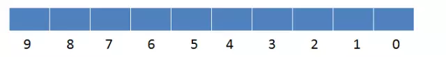
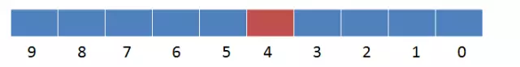
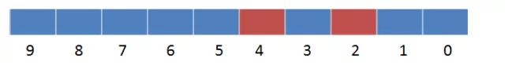

# 随笔

## 1.位域

有些数据在存储时并不需要占用一个完整的字节，只需要占用一个或几个二进制位即可。例如开关只有通电和断电两种状态，用 0 和 1 表示足以，也就是用一个二进位。正是基于这种考虑，C语言又提供了一种叫做位域的数据结构。

在结构体定义时，我们可以指定某个成员变量所占用的二进制位数（Bit），这就是位域，位段成员的类型必须指定为`unsigned`或`int`类型。请看下面的例子：

```c
struct bs{
    unsigned m;
    unsigned n: 4;
    unsigned char ch: 6;
};
```

`:`后面的数字用来限定成员变量占用的位数。成员 m 没有限制，根据数据类型即可推算出它占用 4 个字节（Byte）的内存。成员 n、ch 被:后面的数字限制，不能再根据数据类型计算长度，它们分别占用 4、6 位（Bit）的内存。

### 1.1位域的存储规则

位域的具体存储规则如下：

1.  当相邻成员的类型相同时，如果它们的位宽之和小于类型的 sizeof 大小，那么后面的成员紧邻前一个成员存储，直到不能容纳为止；如果它们的位宽之和大于类型的 sizeof 大小，那么后面的成员将从新的存储单元开始，其偏移量为类型大小的整数倍。
    以下面的位域 bs 为例：

    ```c
    #include <stdio.h>
    int main(){
        struct bs{
            unsigned m: 6;
            unsigned n: 12;
            unsigned p: 4;
        };
        printf("%d\n", sizeof(struct bs));
        return 0;
    }
    ```

    运行结果：4

    m、n、p 的类型都是 unsigned int，sizeof 的结果为 4 个字节（Byte），也即 32 个位（Bit）。m、n、p 的位宽之和为6+12+4 = 22，小于 32，所以它们会挨着存储，中间没有缝隙。

    >   sizeof(struct)的大小之所以为 4，而不是 3，是因为要将内存对齐到 4 个字节，以便提高存取效率

2.  如果成员之间穿插着非位域成员，那么不会进行压缩。例如对于下面的 bs：

    ```c
    struct bs{
        unsigned m: 12;
        unsigned ch;
        unsigned p: 4;
    };
    ```

    在各个编译器下 sizeof 的结果都是 12。

### 1.2无名位域

位域成员可以没有名称，只给出数据类型和位宽，如下所示：

```c
struct bs{
    int m: 12;
    int  : 20;  //该位域成员不能使用
    int n: 4;
};
```

无名位域一般用来作填充或者调整成员位置。因为没有名称，无名位域不能使用。

上面的例子中，如果没有位宽为 20 的无名成员，m、n 将会挨着存储，sizeof(struct bs) 的结果为 4；有了这 20 位作为填充，m、n 将分开存储，sizeof(struct bs) 的结果为 8。

## 2.位图算法

#### 原理

BitMap算法的核心思想是用bit数组来记录0-1两种状态，然后再将具体数据映射到这个比特数组的具体位置，这个比特位设置成0表示数据不存在，设置成1表示数据存在。适用于大规模数据，但数据状态又不是很多的情况。通常是用来判断某个数据存在或不存在的。

**原理解析**
给定长度是10的bitmap，每一个bit位分别对应着从0到9的10个整型数。此时bitmap的所有位都是0。

把整型数4存入bitmap，对应存储的位置就是下标为4的位置，将此bit置为1。

把整型数2存入bitmap，对应存储的位置就是下标为2的位置，将此bit置为1。


#### 应用

BitMap算在在大量数据查询、去重等应用场景中使用的比较多，这个算法具有比较高的空间利用率。例如垃圾邮件过滤、爬虫url过滤、缓存key、判断某个大集合数组是否存在指定数字等

#### BitMap 的优缺点

**优点：**
适合大数据量下的快速去重、快速查询，占用内存空间少。

**缺点：**

1.  数据碰撞。比如将字符串映射到 BitMap 的时候会有碰撞的问题，那就可以考虑用 Bloom Filter 来解决，Bloom Filter 使用多个 Hash 函数来减少冲突的概率。(下一篇介绍)
2.  数据稀疏。又比如要存入(10,8887983,93452134)这三个数据，我们需要建立一个 99999999 长度的 BitMap ，但是实际上只存了3个数据，这时候就有很大的空间浪费，碰到这种问题的话，可以通过引入 Roaring BitMap 来解决。
