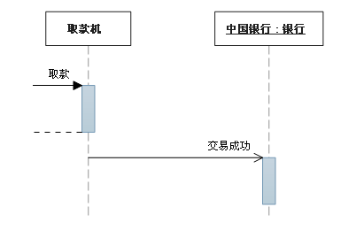
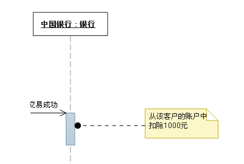

# UML时序图

## 一、概述

> 时序图（Sequence Diagram）是 UML 中最常见的交互图，通过描述对象间发送消息的时间顺序显示多个对象之间的动态协作状态。

时序图对于函数的调用是一种很好的解释，可以清晰的看到函数的各种行为是怎样工作的，所以学习UML时序图是很有必要的。

## 二、时序图详解

时序图的元素有**角色（Actors）**、**对象（Object）**、**生命线（Lifetime）**、**消息（Message）**和**激活（Focus of Control）**等。

### 1.角色（Actors）&对象（Object）

时序图第一步是列出交互中出现的角色和对象。

- 角色：通常指“人”，也可以是组织、机器、系统等“抽象的人”。
- 对象：就是与上述“人”对应的“物”，包括产品、服务、设备等。
  
    1）对象的三种命名方式

第一种方式包括对象名和类名，例如：直播课时:课时，在时序图中，用“对象：类”表示；
第二种方式只显示类名，即表示它是一个匿名对象，例如： :课程；在时序图中，用“：类”表示；
第三种方式只显示对象名不显示类名，例如：讲师；在时序图中，用“对象”表示。
（2）命名方式的选择

三种命名方式均可，哪种最容易让阅读该时序图的人理解，就选择哪种。

（3）对象的排列顺序

对象的左右顺序并不重要，但是为了作图清晰整洁，通常应遵循以下两个原则：

1. **把交互频繁的对象尽可能的靠拢**
2. **把初始化整个交互活动的对象放置在最左端。**

 

时序图的交互，通常由最左侧的Actor发出，然后把所有的“人”和“物”从左至右列出来。

### 2.生命线（LeftTime）

时序图的第二步非常机械：给每个角色和对象加上一条生命线。所谓的生命线就是从角色（或对象）引出向下延伸的虚线，表示时序图存在的时间轴。

### 3.消息（Message）

有了角色和生命线，基本的框架就搭建起来了，然后就可以发送消息来执行函数的功能了。

- 消息的发送者把控制传递给消息的接收者，然后停止活动，等待消息的接收者放弃或者返回控制。用来表示同步的意义；
  
  
- 消息发送者通过消息把信号传递给消息的接收者，然后继续自己的活动，不等待接受者返回消息或者控制。异步消息的接收者和发送者是并发工作的。
  
  
- 返回消息表示从过程调用返回。

消息是有来有往的，发送出去的消息叫 Request（请求），反馈的消息成为 Response（响应）

- 请求用实心箭头示意，并在箭头上方加注说明
- 响应用虚线箭头表示，也会加上简单的返回内容

### 4.组合片段

 

但是，登陆也可能失败！也就是说在时序图上还要添加登陆失败时的消息反馈。这时候就得用到组合片段了；组合片段用来解决交互执行中的条件反馈。

组合片段有十几种，最常用的就是 Alt 片段——抉择片段，通俗来说就是 if-else 的条件判断组合。如上图所示：

- 左上角区域会标明片段的类型
- 片段中用虚线区分不同的条件子域
- 再在子域左上角——注释条件判断
- 最后在各自的条件子域上返回特定响应

组合片段用来解决交互执行的条件和方式，它允许在序列图中直接表示逻辑组件，用于通过指定条件或子进程的应用区域，为任何生命线的任何部分定义特殊条件和子进程。

|片段类型|名称|说明|
|--|--|--|
|Opt|选项|包含一个可能发生或者可能不发生的序列。可以在临界中指定序列发生的条件。|
|Alt|抉择|抉择用来指明在两个或更多的消息序列之间的互斥的选择，相当于经典的if..else..。  　　抉择在任何场合下只发生一个序列。 可以在每个片段中设置一个临界来指示该片段可以运行的条件。else 的临界指示其他任何临界都不为 True 时应运行的片段。如果所有临界都为 False 并且没有 else，则不执行任何片段。|
|Loop|循环|片段重复一定次数。可以在临界中指定重复条件。Loop组合有“Max”和“Min”属性，是指循环的最大或者最小次数，默认无限制|
|Break|中断|如果执行此片段，则放弃其余部分。可在临界中指定发生中断的条件|
|Par|并行|并行处理。片段中事件可以交错|
|Critical|关键|用在Par或者Seq片段中。指示此片段中的消不得与其他消息交错。|
|Seq|弱顺序|有两个或者更多操作数片段。涉及同一生命线的消息必须以片段的顺序发生。如果消息涉及到不同的生命线，来自不同片段的消息可能并行交错。|
|Strict|强顺序|有两个或者更多操作数的片段。这些片段必须按给定的顺序发生。|
|Consider|考虑|指定此片段描述的消息列表。其他消息可发生在运行的系统中，但对此描述来说意义不大。|
|Ignore|忽略|指定此片段描述的消息列表。其他消息可发生在运行的系统中，但对此描述来说意义不大。|
|Neg|否定|此片段中显示的序列不得发生。通常用在Consider和Ignore中。|

#### 1）抉择（Alt）

抉择在任何场合下只发生一个序列。 可以在每个片段中设置一个临界来指示该片段可以运行的条件。else 的临界指示其他任何临界都不为 True 时应运行的片段。如果所有临界都为 False 并且没有 else，则不执行任何片段。

#### 2）选项（Opt）

包含一个可能发生或不发生的序列；

#### 3）循环（Loop）

片段重复一定次数，可以在临界中指示片段重复的条件。

#### 4）并行（Par）

并行处理。片段中事件可以交错

### 5.焦点控制（Focus of Control）

控制焦点又称激活，是覆盖在生命线上一段细长的矩形，表示在这个时间段内，对象或角色正处于活动状态；这有点类似于 java 语言里的大括号{}——作用域。

### 6.其他元素

#### 1）注释

#### 2）约束

约束的符号很简单；

格式是: [Boolean Test]

