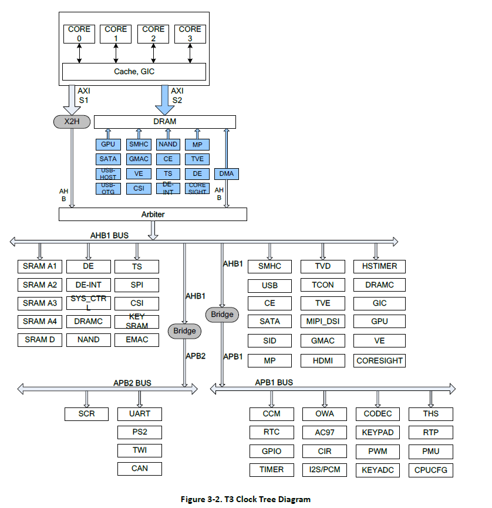

# 全志T3

## 1.Uboot环境配置

1.  配置uboot加载kernel.bin的环境变量

    ```shell
    setenv boot_microkernel "sunxi_card0_probe;fatload mmc 0:1 0x50000000 kernel.bin;go 0x50000000";
    setenv bootcmd "run boot_microkernel";
    saveenv;
    ```

2.  可信引导配置(需要刷入可信引导的uboot)

    ```shell
    setenv boot_microkernel "sunxi_card0_probe;fatload mmc 0:1 0x50000000 kernel.img;go 0x50000000";
    setenv bootcmd "run boot_microkernel";
    saveenv;
    ```

    

## 2.时钟分析




