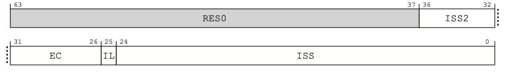
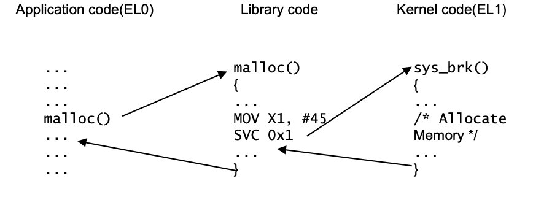
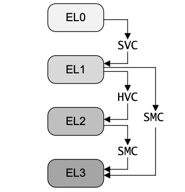

#ARMV8_AARCH64裸机启动流程分析

[toc]

本篇针对于ARMV8架构下64位模式的裸机启动代码流程分析，重点介绍裸机启动代码bootcode.s。重点了解ARM处理器从上电到跳转到main函数的过程

## 1.寄存器初始化

首先需要初始化相关寄存器

-   通用寄存器
-   SP寄存器
-   System control registers(控制寄存器)

### 1.1 初始化通用寄存器

ARM处理器使⽤⼀些⾮复位触发器。这可能会导致模拟中出现X传播问题。寄存器初始化有助于减少问题的可能性。寄存器的低32位⽤w来表示

`注`:由于X状态仅存在于硬件模拟中，因此在硅芯⽚上不需要此初始化。

对寄存器的初始化代码如下所示:

```assembly
/*code1-1: Initialize the stack pointer.*/
MOV X0,XZR
......
MOV X30,XZR
```

如果处理器实现NEON和FP扩展功能,浮点寄存器也必须初始化

```assembly
/*code1-2: Floating-point registers initialization*/
MSR CPTR_EL3,XZR
MSR CPTR_EL2,XZR
FMOV D0,XZR
FMOV D1,XZR
......
FMOV D31,XZR
```

---

### 1.2 初始化SP寄存器

堆栈指针(SP)寄存器隐式的用于某些指令中,例如push和pop.在使用它之前,必须使用正确的值进行初始化.

在MPcore系统中,不同的堆栈指针必须指向不同的内存地址,已避免覆盖堆栈区域.如果使用不同异常级别的SP,则必须初始化它们

例如,为了当前异常级别初始化SP指针,SP指向的堆栈位于堆栈顶部,堆栈大小CPU_STACK_SIZE

```assembly
/*code1-3: Initialize the stack pointer.*/
ADR X1,stack_top
ADD X1,X1,#4
MRS X2,MPIDR_EL1
AND X2,X2,#0xFF		//X2 == CPU number
MOV X3,#CPU_STACK_SIZE
MUL X3,X2,X3 		//Create separated stack spaces
SUB X1,X1,X3		//for each processor
MOV SP,X1
```

---

### 1.3  初始化系统控制寄存器

某些系统控制寄存器没有复位值.因此,在使用寄存器之前,必须根据软件要求对其进行初始化.

下面例子展示了在复位之后如何初始化HCR_EL2,SCTLR_EL2和SCTLR_EL1

```assembly
/*code1-4:Example 5-9 System control registers initialization*/
MSR HCR_EL2, XZR
LDR X1,=0x30C50838
MSR SCTLR_EL2, X1 
MSR SCTLR_EL1, X1
```

本例不包括所有需要初始化的系统寄存器。理论上，必须初始化所有没有定义重置值的系统寄存器。但是，根据特定处理器的实现，某些寄存器的值已经提前定义好了，更多的细节见ARMV8⼿册。寄存器具体需要配置什么值，请看armV8⼿册，根据⾃⼰的需要去配置。

---

## 2.异常初始化

异常初始化要求:

-   设置异常向量表
-   异步异常路由和屏蔽配置

### 2.1 设置异常向量表

在AArch64中,复位向量不再是异常向量表的⼀部分,它有专门的配置输⼊引脚和复位向量寄存器.其他异常向量存储在向量表中

`复位向量`

在AArch64中,处理器从IMPLEMENTAION-DEFINED的地址开始执⾏,该地址由硬件输⼊引脚RVBARADDR定义,可由RVBAR_EL3
寄存器读取.必须在此地址放置引导代码（bootcode）.


`异常向量表`

每个异常级别都有专用的向量表

-   VBAR_EL3
-   VBAR_EL2
-   VBAR_EL1

AArch64中的向量表与AArch32中的向量表不同.AArch64模式下的向量表包含16个⼊⼝地址.每个⼊⼝地址的⼤⼩为128B,最多包
含32条指令.向量表必须放置在2KB对齐的地址.通过初始化VBAR_ELn寄存器来设置地址.关于更多的异常向量表的细节,请查看《ARM® Architecture Reference Manual ARMv8, for ARMv8-A architecture profile》⼿册.


下面代码⽰例展⽰了在复位之后如何初始化VBAR_EL3,VBAR_EL2,and VBAR_EL1.

```assembly
/*code:2-1 Vector Base Address registers*/
// Initialize VBAR_EL3. 
LDR X1,= vector_table_el3 
MSR VBAR_EL3, X1 
LDR X1,= vector_table_el2 
MSR VBAR_EL2, X1 
LDR X1,= vector_table_el1 
MSR VBAR_EL1, X1
```


下面代码展⽰了AArch64中的典型异常向量表代码

```assembly
/*code2-2: Typical exception vector table code.*/
.balign 0x800
Vector_table_el3:
curr_el_sp0_sync:// The exception handler for the synchronous // exception from the current EL using SP0. 
.balign 0x80
curr_el_sp0_irq:// The exception handler for the IRQ exception // from the current EL using SP0.
.balign 0x80
curr_el_sp0_fiq:// The exception handler for the FIQ exception // from the current EL using SP0.
.balign 0x80
curr_el_sp0_serror:// The exception handler for the system error // exception from the current EL using SP0. 
.balign 0x80
curr_el_spx_sync:// The exception handler for the synchronous // exception from the current EL using the // current SP. 
.balign 0x80
curr_el_spx_irq:// The exception handler for IRQ exception // from the current EL using the current SP
```

---

### 2.2 启用异步异常

异步异常包括SError、IRQ和FIQ,它们在复位后默认被屏蔽.因此，如果要启⽤SError、IRQ和FIQ的话,必须设置路由规则并清除屏蔽设置.

要启⽤中断，还必须初始化外部中断,以将中断传递给处理器,但本⽂档中没有介绍中断的相关知识.有关中断知识可以去官⽹下载GIC相关⽂档。

`Asynchronous exceptions routing（异步异常路由）`

异步异常路由确定⽤于处理同步异常的异常级别.

要将异步异常路由到EL3，必须设置SCR_EL3.{EA，IRQ，FIQ}.

下面的代码展⽰了如何把SError、IRQ和FIQ异步异常事件路由到EL3

```assembly
code2-3: SError, IRQ and FIQ routing enablement in EL3
MRS X0, SCR_EL3
ORR X0, X0, #(1<<3)// The EA bit.
ORR X0, X0, #(1<<1)// The IRQ bit.
ORR X0, X0, #(1<<2)// The FIQ bit.
MSR SCR_EL3, X0
```

如果你想把异步异常路由到EL2，你必须设置HCR_EL2.{AMO,FMO,IMO}，并且清除SCR_EL3.{EA,IRQ,FIQ}.

下面例子展⽰了如何把SError、IRQ和FIQ异步异常事件路由到EL2

```assembly
MRS X0, HCR_EL2 
ORR X0, X0, #(1<<5)// The AMO bit.
ORR X0, X0, #(1<<4)// The IMO bit.
ORR X0, X0, #(1<<3)// The FMO bit.
MSR HCR_EL2, X0
```

如果中断没有路由到EL2和EL3,那么就默认路由到EL1

`Asynchronous exceptions mask（异步异常屏蔽）`

异步异常是否被屏蔽取决于以下因素：

-   中断路由到的目标异常级别
-   PSTATE{A,I,F}

当⽬标异常级别低于当前异常级别时,⽆论PSTATE.{A，I，F}值如何,异步异常都会被隐式屏蔽.

当⽬标异常级别与当前异常级别相同时,如果PSTATE.{A，I，F}为1，则会屏蔽异步异常.

当⽬标异常级别⾼于当前异常级别且⽬标异常级别为EL2或EL3时,不管PSTATE.{A，I，F}值是多少,都会执⾏异步异常

当⽬标异常级别⾼于当前异常级别且⽬标异常级别为EL1时,如果PSTATE.{A，I，F}为1，则会屏蔽异步异常.

下列代码展示了如何在PSTATE中清除SError、IRQ和FIQ屏蔽位.

```assembly
// code2-5:Enable SError, IRQ and FIQ 
MSR DAIFClr, #0x7
```

---

## 3.配置MMU和Cache

配置MMU和Cache需要以下步骤

-   清理并使缓存无效
-   设置MMU
-   使能MMU和Cache

### 3.1 清理并使缓存无效

系统复位后,cache中的内容⽆效.ARMv8-A处理器实现的硬件在复位后⾃动使所有cache失效,因此复位后不需要软件清除.但是,在某些情况下,清理和使数据缓存⽆效仍然是必要的（数据cache）,例如内核断电过程

下面代码展⽰了如何使⽤EL3中的循环DC CISW指令清除⼀级数据缓存（L1 date cache）并使其失效.由此可以轻松修改其他级别缓存或
其他缓存操作的代码.

```assembly
/*code3-1: Clean and invalidate L1 data cache*/
// Disable L1 Caches 
MRS X0, SCTLR_EL3 // Read SCTLR_EL3. 
BIC X0, X0, #(0x1 << 2)// Disable D Cache. 
MSR SCTLR_EL3, X0 // Write SCTLR_EL3. 
// Invalidate Data cache to make the code general purpose. 
// Calculate the cache size first and loop through each set + way. 
MOV X0, #0x0// X0 = Cache level 
MSR CSSELR_EL1, x0 // 0x0 for L1 Dcache 0x2 for L2 Dcache. （每个核有两级cache,L3）

MRS X4, CCSIDR_EL1  // Read Cache Size ID. 
AND X1, X4, #0x7
ADD X1, X1, #0x4// X1 = Cache Line Size. 
LDR X3,=0x7FFF
AND X2, X3, X4, LSR #13// X2 = Cache Set Number – 1. 
LDR X3,=0x3FF
AND X3, X3, X4, LSR #3// X3 = Cache Associativity Number – 1. 
CLZ W4, W3  // X4 = way position in the CISW instruction. 

MOV X5, #0// X5 = way counter way_loop. 
way_loop:
MOV X6, #0// X6 = set counter set_loop. 
set_loop:
LSL X7, X5, X4
ORR X7, X0, X7  // Set way. 
LSL X8, X6, X1 
ORR X7, X7, X8  // Set set. 
DC cisw, X7   // Clean and Invalidate cache line.
ADD X6, X6, #1// Increment set counter. 
CMP X6, X2   // Last set reached yet? 
BLE set_loop  // If not, iterate set_loop, 
ADD X5, X5, #1// else, next way. 
CMP X5, X3   // Last way reached yet? 
BLE way_loop  // If not, iterate way_loop.
```

---

### 3.2 设置MMU

ARMv8-A处理器使⽤VMSAv8-64在AArch64上执⾏以下操作：

-   物理地址到虚拟地址的转换
-   确定内存属性并检查访问权限

地址转换由转换表定义并由MMU管理。每个异常级别都有⼀个专⽤的转换页表。启⽤MMU之前必须设置转换表。

VMSAv8-64在转换表中使⽤64位描述符格式。它⽀持：

-   最多48位输⼊和输出地址；
-   三种颗粒度：4KB，16KB，64KB；
-   最多四个级别的地址查找。

⽰例3-2和⽰例3-3构建⼀个EL3页表，其粒度为4KB，覆盖4GB内存空间：

-   0～1GB内存被配置为正常缓存的内存；
-   1~4GB内存配置为Device-nGnRnE内存。

转换表包含512个2MB⼤⼩的level2块和3个1GB⼤⼩的level1块。
⽰例3-2⾸先初始化转换表控制寄存器，然后使⽤循环存储指令构建转换表，这更易于移植。

```assembly
/*3-2*/
// Initialize translation table control registers
LDR X1,=0x3520// 4GB space 4KB granularity
// Inner-shareable.
MSR TCR_EL3, X1 // Normal Inner and Outer Cacheable.
LDR X1,=0xFF440400// ATTR0 Device-nGnRnE ATTR1 Device.
MSR MAIR_EL3, X1 // ATTR2 Normal Non-Cacheable.
// ATTR3 Normal Cacheable.
ADR X0, ttb0_base  // ttb0_base must be a 4KB-aligned address.
MSR TTBR0_EL3, X0
// Set up translation table entries in memory with looped store
// instructions.
// Set the level 1 translation table.
// The first entry points to level2_pagetable.
LDR X1,= level2_pagetable // Must be a 4KB align address.
LDR X2,=0xFFFFF000
AND X2, X1, X2 // NSTable=0 APTable=0 XNTable=0 PXNTable=0.
ORR X2, X2,0x3
STR X2,[X0], #8
// The second entry is 1GB block from 0x40000000 to 0x7FFFFFFF.
LDR X2,=0x40000741// Executable Inner and Outer Shareable.
STR X2,[X0], #8// R/W at all ELs secure memory
// AttrIdx=000 Device-nGnRnE.
// The third entry is 1GB block from 0x80000000 to 0xBFFFFFFF.
LDR X2,=0x80000741
STR X2,[X0], #8
// The fourth entry is 1GB block from 0xC0000000 to 0xFFFFFFFF.
LDR X2,=0xC0000741
STR X2,[X0], #8
// Set level 2 translation table.
LDR X0,=level2_pagetable // Base address of level2_pagetable.
LDR X2,=0x0000074D// Executable Inner and Outer Shareable.
// R/W at all ELs secure memory.
// AttrIdx=011 Normal Cacheable.
MOV X4, #512// Set 512 level2 block entries.
LDR X5,=0x00200000// Increase 2MB address each time.
loop:
STR X2,[X0], #8// Each entry occupies 2 words.
ADD X2, X2, X5
SUBS X4, X4, #1
BNE loop
```

⽰例3-3在编译时创建⼀个段作为转换表。这种⽅法对于仿真是快速的。它是⽤GNU汇编语法编写的。⽰例5-11中初始化转换表控制寄存
器的代码仍然是必需的。

```assembly
/*code3-3*/
// Put a 64-bit value with little endianness.
.macro PUT_64B high, low
.word \low
.word \high
.endm
// Create an entry pointing to a next-level table.
.macro TABLE_ENTRY PA, ATTR
PUT_64B \ATTR,(\PA)+0x3
.endm
// Create an entry for a 1GB block.
.macro BLOCK_1GB PA, ATTR_HI, ATTR_LO
PUT_64B \ATTR_HI,((\PA)&0xC0000000)| \ATTR_LO |0x1
.endm
// Create an entry for a 2MB block.
.macro BLOCK_2MB PA, ATTR_HI, ATTR_LO
PUT_64B \ATTR_HI,((\PA)&0xFFE00000)| \ATTR_LO |0x1
.endm
.align 12// 12 for 4KB granule.
ttb0_base:
TABLE_ENTRY level2_pagetable,0
BLOCK_1GB 0x40000000,0,0x740
BLOCK_1GB 0x80000000,0,0x740
BLOCK_1GB 0xC0000000,0,0x740
.align 12// 12 for 4KB granule.
level2_pagetable:
.set ADDR,0x000// The current page address.
.rept 0x200
BLOCK_2MB(ADDR <<20),0,0x74C
.set ADDR, ADDR+2
.endr
```

---

### 3.3 启动MMU和Cache

必须先初始化MMU和cache,然后才能启⽤它们.在启⽤MMU和缓存以⽀持硬件之前,所有ARMv8-A处理器都需要设置SMPEN位⼀致
性.

下面代码展示了如何设置SMPEN位并启用MMU和Cache

```assembly
/*code3-4:*/
// It is implemented in the CPUECTLR register.
MRS X0, S3_1_C15_C2_1
ORR X0, X0, #(0x1<<6)// The SMP bit.
MSR S3_1_C15_C2_1, X0
// Enable caches and the MMU.
MRS X0, SCTLR_EL3
ORR X0, X0, #(0x1<<2)// The C bit (data cache).
ORR X0, X0, #(0x1<<12)// The I bit (instruction cache).
ORR X0, X0, #0x1// The M bit (MMU).
MSR SCTLR_EL3, X0
DSB SY
ISB
```

---

## 4.启动NEON和浮点单元

在AArch64中，您不需要启⽤对NEON和FP寄存器的访问。然⽽，对NEON和FP寄存器的访问仍然可能被捕获

下面代码展示了如何在所有异常级别禁⽤对NEON和FP寄存器的访问捕获。

```assembly
/*4-1*/
// Disable trapping of accessing in EL3 and EL2. 
MSR CPTR_EL3, XZR 
MSR CPTR_EL3, XZR 
// Disable access trapping in EL1 and EL0. 
MOV X1, #(0x3<<20)// FPEN disables trapping to EL1. 
MSR CPACR_EL1, X1 
ISB
```

## 5.切换异常等级

ARMV8具有4种异常等级：

-   EL0：⽤户等级
-   EL1：操作系统内核
-   EL2：Hypervisor
-   EL3：安全世界状态核正常世界的切换

有时，必须在测试⽤例中的这些异常级别之间进⾏切换。当发⽣或返回异常时，处理器会切换异常级别。

### 5.1 EL3到EL0之间的切换

处理器在复位后进⼊EL3。未定义较低异常级别的控制寄存器和异常状态。要进⼊较低的异常级别，必须初始化执⾏状态和控制寄存器，然
后通过执⾏ERET指令使⽤伪异常返回。见下面代码

```assembly
/*code5-1*/
// Initialize SCTLR_EL2 and HCR_EL2 to save values before entering EL2.
MSR SCTLR_EL2, XZR
MSR HCR_EL2, XZR
// Determine the EL2 Execution state.
MRS X0, SCR_EL3
ORR X0, X0, #(1<<10)// RW EL2 Execution state is AArch64.
ORR X0, X0, #(1<<0)// NS EL1 is Non-secure world.
MSR SCR_EL3, x0
MOV X0, #0b01001 // DAIF=0000
MSR SPSR_EL3, X0 // M[4:0]=01001 EL2h must match SCR_EL3.RW
// Determine EL2 entry.
ADR X0, el2_entry // el2_entry points to the first instruction of
MSR ELR_EL3, X0 // EL2 code.
ERET
el2_entry:
// Initialize the SCTLR_EL1 register before entering EL1.
MSR SCTLR_EL1, XZR
// Determine the EL1 Execution state.
MRS X0, HCR_EL2
ORR X0, X0, #(1<<31)// RW=1 EL1 Execution state is AArch64.
MSR HCR_EL2, X0
MOV X0, #0b00101 // DAIF=0000
MSR SPSR_EL2, X0 // M[4:0]=00101 EL1h must match HCR_EL2.RW.
ADR X0, el1_entry // el1_entry points to the first instruction of
MSR ELR_EL2, X0 // EL1 code.
ERET
el1_entry:
// Determine the EL0 Execution state.
MOV X0, #0b00000 // DAIF=0000 M[4:0]=00000 EL0t.
MSR SPSR_EL1, X0
ADR x0, el0_entry // el1_entry points to the first instruction of
MSR ELR_EL1, X0 // EL0 code.
ERET
el0_entry:
// EL0 code here.
```

### 5.2 EL2到EL1之间的切换

可以在不同的异常级别混合执⾏状态。当较⾼的异常级别使⽤AArch64时，较低的异常级别可以使⽤AArch64或AArch32。因此，可以
从AArch64中较⾼的异常级别更改为AArch32中较低的异常级别。见下面代码

```assembly
/*5-2*/
// Initialize the SCTLR_EL1 register before entering EL1.
MSR SCTLR_EL1, XZR
MRS X0, HCR_EL2
BIC X0, X0, #(1<<31)// RW=0 EL1 Execution state is AArch32.
MSR HCR_EL2, X0
MOV X0, #0b10011 // DAIF=0000
MSR SPSR_EL2, X0 // M[4:0]=10011 EL1 is SVC mode must match HCR_EL2.RW.
// Determine EL1 Execution state.
ADR X0, el1_entry  // el1_entry points to the first instruction of SVC
MSR ELR_EL2, X0 // mode code.
ERET
el1_entry:
// EL1 code here.
```

`备注`:

在多核启动的时候，每个核都会去执⾏⼀段公共代码（boot.s）去判断⾃⼰是否为CPU0核（mpidr_el1有标识号），如果不是则进⼊WFI
休眠状态，如果是CPU0核测执⾏相应的程序。

---

### 5.3异常处理

在ARM64中，除了中止、复位和软件异常外，中断也是属于异常的一种。

#### 异常种类

##### 1、中断

在ARM中，FIQ的优先级要高于IRQ，在SOC内部会有一个中断控制器负责中断优先级调度，然后发送中断信号给处理器。中断属于**异步模式**的异常。

##### 2、中止

中止异常分为**数据中止**和**指令中止**，MMU能够捕获错误并汇报给处理器。

##### 3、复位

复位是处理器中优先级最高的异常，通常分为**上电复位**和**软件复位**。

##### 4、软件产生的异常

ARMv8提供了3中软件产生的异常，发生此异常的原因是软件企图进入更高的异常等级。

-   SVC 允许用户模式下的程序请求os服务
-   HVC 允许客户机（Linux os）请求主机服务
-   SMC 允许普通世界的程序请求安全服务

#### 同步异常和异步异常

故名思议，**`同步异常`**必须等待cpu处理完当前异常才可以继续执行指令。

常见的同步异常：

-   **访问其他等级的寄存器**，比如当前是EL1，如果访问EL2的寄存器就会出现异常
-   **SP未对齐**
-   **SVC、HVC和SMC**
-   **地址翻译错误/地址权限**

常见的异步异常：

-   **物理中断** IRQ、FIQ和系统错误
-   **虚拟中断** vIRQ、vFIQ、vSError（埋个点吧，后续了解一下）

#### 异常后的处理

**异常综合寄存器（ESR_ELn）**和**故障地址寄存器（FAR_ELn）**是为异常处理程序提供关于同步异常原因的信息。

ESR_ELn保存了**异常原因**，而FAR_ELn保存了所有同步指令和数据中止以及**对齐故障的故障虚拟地址。**

**异常链接寄存器(ELR_ELn)**也保存了导致中止数据访问的指令的地址(对于数据中止)。这些在内存故障后被更新，但在其他情况下也会被设置，例如，通过分支到错位的地址。如果一个异常从AArch32中的异常级别进入使用AArch64的异常级别，并且该异常写入了与目标异常级别相关的故障地址寄存器，FAR_ELn的前32位都被设置为0。

异常综合寄存器，ESR_ELn，包含了允许异常处理程序确定异常原因的信息。它只对同步异常和SError进行更新。**它不对IRQ或FIQ进行更新**，因为这些中断处理程序通常从通用中断控制器（GIC）的寄存器中获取状态信息。



Bit[31:26]（ESR_ELn.EC）表示异常类别，它使处理程序能够区分各种可能的异常原因（**如未分配的指令，从MCR或MRC到CP15的异常，FP操作的异常，SVC、HVC或SMC的执行，数据中止，以及对齐异常**）。例如，EC=101111是一个SError中断。

Bit[25]（ESR_ELn.IL）表示被困指令的长度（16位指令为0，32位指令为1），并对某些异常类别进行设置。

Bit[24:0] (ESR_ELn.ISS)构成指令特定综合症(ISS)字段，包含该异常类型的特定信息。例如，当一个系统调用指令（SVC、HVC或SMC）被执行时，该字段包含与操作码相关的即时值，如SVC为0x123456。

#### 系统调用

一些指令或系统功能只能在特定的Exception级别进行。例如，如果运行在较低Exception级别的代码必须执行一个特权操作，例如当应用程序代码向内核请求功能时。一种方法是通过使用SVC指令来实现。这允许应用程序产生一个异常。参数可以在寄存器中传递，或者在系统调用中编码。

例如：EL0的应用程序代码使用malloc()请求内存。



#### 对EL2/EL3的系统调用

**SVC指令**可以用来从**EL0**的用户应用程序**调用到EL1**的内核。**HVC和SMC**系统调用指令以类似的方式将处理器**移动到EL2和EL3**。当处理器在EL0（应用程序）执行时，它不能直接调用管理程序（EL2）或安全监视器（EL3）。这只有在EL1和以上的地方才有可能。因此，应用程序必须使用SVC来调用内核，并允许内核代表它们调用更高的异常级别。

在操作系统内核（EL1），软件可以用HVC指令调用管理程序（EL2），或用SMC指令调用安全监视器（EL3）。如果处理器是用EL3实现的，就可以提供让EL2从EL1捕获SMC指令的能力。如果没有EL3，SMC是未分配的，并在当前的异常级别触发。



同样，从管理程序代码（EL2）中，程序可以用SMC指令调用安全监视器（EL3）。如果你在EL2或EL3时进行SMC调用，它仍然会在同一个异常级别上引起一个同步异常，该异常级别的处理程序可以决定如何响应。

#### 处理异常的流程

**ARMv8的四个异常级别只能通过异常获取/返回的方式在异常等级之间跳转。**

-   将PSTATE寄存器内容保存到对应等级的SPSR_ELx中（**保存PSTATE现场**）
-   保存返回地址到对应等级的ELR_ELx寄存器中（**保存返回地址**）
-   将PSTATE中的DAIF设1，即关闭调试异常、SError、IRQ和FIQ
-   设置对应异常等级下的栈指针，自动切换SP到SP_ELx
-   切换到对应目标异常等级，跳转到异常向量表执行

以上都是处理器自动完成的，OS所需要做的事就是从中断向量表开始，根据发生的异常类型，跳转到合适的异常向量。

当异常处理完后，执行eret指令从异常返回。eret会**从ELR_ELx中恢复PC指针**并且**从SPSR_ELx中恢复到PSTATE中**。